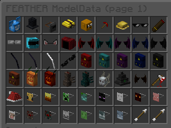

> # CustomModelData
> ### This plugin allows you to view and get CustomModelData of the item you have in your main hand via GUI

-----

> ### Example
>
> 

-----

> For questions or bug reports, [@Viques](https://t.me/Viques)
